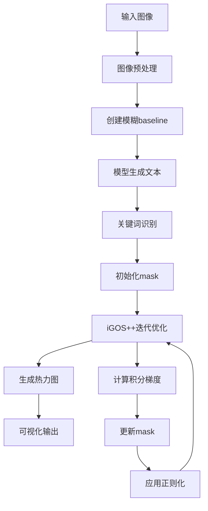

# QwenVL 可视化工作流算法详解

## 📋 目录
- [概述](#概述)
- [核心算法：iGOS++](#核心算法igos)
- [完整工作流程](#完整工作流程)
- [关键步骤详解](#关键步骤详解)
- [可视化结果生成](#可视化结果生成)
- [参数说明](#参数说明)

---

## 概述

本项目实现了一个基于 **iGOS++ (Integrated Gradients Optimized Saliency)** 的视觉解释方法，用于解释大型视觉语言模型（如 QwenVL）的决策过程。该算法通过生成显著性热力图来展示图像中哪些区域对模型的特定输出最为重要。

### 主要特点
- ✅ 基于积分梯度的优化方法
- ✅ 同时优化删除和插入mask
- ✅ 支持多种正则化约束
- ✅ 适用于大型视觉语言模型

---

## 核心算法：iGOS++

### 算法思想

iGOS++ 是一种**扰动-based**的可解释性方法，其核心思想是：

1. **删除目标**：找到图像中最重要的区域，删除这些区域应该最大程度降低模型对目标词的预测概率
2. **插入目标**：从模糊图像开始，插入这些重要区域应该最大程度提升模型对目标词的预测概率
3. **组合优化**：同时优化删除和插入两个mask，使其互补且一致

### 数学表达

算法优化以下目标函数：

```
minimize: L_del(mask_del) + L_ins(mask_ins) + L_reg(mask_del * mask_ins)
```

其中：
- **L_del**：删除损失，衡量删除重要区域后模型预测的下降程度
- **L_ins**：插入损失，衡量插入重要区域后模型预测的提升程度
- **L_reg**：正则化项，包括 L1、L2 和 TV norm

---

## 完整工作流程



### 流程图解

```
┌─────────────────────────────────────────────────────────────┐
│                     1. 图像预处理阶段                         │
├─────────────────────────────────────────────────────────────┤
│  原始图像                                                    │
│     ↓                                                       │
│  调整尺寸 (保持宽高比, 最大512px, 28的倍数)                   │
│     ↓                                                       │
│  创建模糊版本 (高斯模糊作为baseline)                          │
└─────────────────────────────────────────────────────────────┘

┌─────────────────────────────────────────────────────────────┐
│                     2. 模型推理阶段                           │
├─────────────────────────────────────────────────────────────┤
│  原图 + 文本提示 → 模型 → 生成文本描述                        │
│     ↓                                                       │
│  提取生成的token IDs和位置                                   │
└─────────────────────────────────────────────────────────────┘

┌─────────────────────────────────────────────────────────────┐
│                     3. 关键词识别阶段                         │
├─────────────────────────────────────────────────────────────┤
│  计算原图的预测概率 P(关键词|原图)                            │
│  计算模糊图的预测概率 P(关键词|模糊图)                        │
│     ↓                                                       │
│  选择满足条件的token:                                        │
│  log P(关键词|原图) - log P(关键词|模糊图) > 1.0              │
└─────────────────────────────────────────────────────────────┘

┌─────────────────────────────────────────────────────────────┐
│                     4. iGOS++优化阶段                         │
├─────────────────────────────────────────────────────────────┤
│  初始化: mask_del = 1, mask_ins = 1                         │
│     ↓                                                       │
│  迭代优化 (默认10次):                                        │
│    ├─ 上采样mask到图像尺寸                                   │
│    ├─ 计算组合mask的积分梯度                                 │
│    ├─ 计算删除mask的积分梯度                                 │
│    ├─ 计算插入mask的积分梯度                                 │
│    ├─ 计算正则化损失 (L1, L2, TV)                            │
│    ├─ 累加梯度并更新mask                                     │
│    └─ 限制mask值在[0,1]范围内                                │
└─────────────────────────────────────────────────────────────┘

┌─────────────────────────────────────────────────────────────┐
│                     5. 可视化生成阶段                         │
├─────────────────────────────────────────────────────────────┤
│  最终mask = mask_del * mask_ins                             │
│     ↓                                                       │
│  归一化到[0,1]                                               │
│     ↓                                                       │
│  生成JET colormap热力图                                      │
│     ↓                                                       │
│  叠加到原图 (alpha=0.4)                                      │
└─────────────────────────────────────────────────────────────┘
```

---

## 关键步骤详解

### 1. 图像预处理

**代码位置**: `gen_explanations_qwenvl()` 函数

```python
# 调整图像尺寸，保持宽高比
max_size = 512
original_width, original_height = image.size
aspect_ratio = original_width / original_height

if original_width > original_height:
    new_width = min(max_size, original_width)
    new_height = int(new_width / aspect_ratio)
else:
    new_height = min(max_size, original_height)
    new_width = int(new_height * aspect_ratio)

# 确保尺寸是28的倍数（适配QwenVL模型）
new_width = round(new_width / 28) * 28
new_height = round(new_height / 28) * 28
```

**为什么要这样做？**
- 保持宽高比：避免图像变形
- 最大512像素：平衡计算效率和细节保留
- 28的倍数：QwenVL模型的patch size要求

### 2. 创建Baseline

```python
# 使用高斯模糊创建baseline
kernel_size = get_kernel_size(image.size)  # 根据图像大小自适应
blur = cv2.GaussianBlur(np.asarray(image), (kernel_size, kernel_size), sigmaX=kernel_size-1)
```

**为什么用模糊图像？**
- 积分梯度方法需要一个baseline（参考点）
- 模糊图像保留了图像的整体结构，但去除了细节
- 便于比较原图和模糊图的差异

### 3. 关键词识别

**代码位置**: `find_keywords()` 函数

```python
def find_keywords(model, inputs, generated_ids, output_ids, image, blur_image, 
                  target_token_position, selected_token_word_id, tokenizer):
    # 计算原图和模糊图的预测概率
    probs = pred_probs(model, inputs, generated_ids, image, 
                       target_token_position, selected_token_word_id)
    probs_blur = pred_probs(model, inputs, generated_ids, blur_image, 
                            target_token_position, selected_token_word_id)
    
    # 选择对图像敏感的关键词
    condition = (torch.log(probs) - torch.log(probs_blur) > 1.0) & \
                (probs >= 0.0) & \
                (~torch.isin(output_ids[0], torch.tensor(special_ids).to(probs.device)))
    
    positions = torch.where(condition)[0].tolist()
    keywords = [tokenizer.decode(output_ids[0][idx]).strip() for idx in positions]
    
    return positions, keywords
```

**识别逻辑**：
1. 比较原图和模糊图的预测概率
2. 选择log概率差异大于1.0的token
3. 过滤掉特殊token（标点符号等）

### 4. 积分梯度计算

**代码位置**: `integrated_gradient()` 和 `interval_score()` 函数

```python
def interval_score(model, inputs, generated_ids, images, target_token_position, 
                   selected_token_word_id, baseline, up_masks, num_iter, 
                   noise=True, positions=None, processor=None):
    # 创建积分区间
    intervals = torch.linspace(1/num_iter, 1, num_iter).view(-1, 1, 1, 1)
    interval_masks = up_masks.unsqueeze(1) * intervals
    
    # 在mask路径上采样
    local_images = phi(images.unsqueeze(1), baseline.unsqueeze(1), interval_masks)
    
    if noise:
        local_images = local_images + torch.randn_like(local_images) * 0.2
    
    # 计算每个采样点的损失
    losses = torch.tensor(0.).to(model.device)
    for single_img in local_images:
        probs = pred_probs(model, inputs, generated_ids, single_img, 
                          target_token_position, selected_token_word_id, need_grad=True)
        losses += torch.log(probs)[positions].sum()
    
    return losses / num_iter
```

**积分梯度原理**：
- 从baseline到原图的路径上积分梯度
- 使用黎曼和近似积分
- 添加噪声提高鲁棒性

### 5. iGOS++迭代优化

**代码位置**: `iGOS_pp()` 函数

```python
def iGOS_pp(model, inputs, generated_ids, init_mask, image, 
            target_token_position, selected_token_word_id, baseline, label,
            size=32, iterations=10, ig_iter=10, L1=1.0, L2=0.1, L3=10.0, lr=1e-4):
    
    # 初始化删除和插入mask
    masks_del = torch.ones((1, 1, size, size)) * init_mask
    masks_ins = torch.ones((image.shape[0], 1, size, size)) * init_mask
    
    for i in range(iterations):
        # 上采样mask
        up_masks1 = upscale(masks_del, image)
        up_masks2 = upscale(masks_ins, image)
        
        # 计算组合mask的积分梯度（删除方向）
        loss_comb_del = integrated_gradient(model, inputs, generated_ids, image, 
                                           target_token_position, selected_token_word_id, 
                                           baseline, up_masks1 * up_masks2, ig_iter)
        
        # 计算组合mask的积分梯度（插入方向）
        loss_comb_ins = integrated_gradient(...)
        
        # 计算删除mask的积分梯度
        loss_del = integrated_gradient(...)
        
        # 计算插入mask的积分梯度
        loss_ins = integrated_gradient(...)
        
        # 计算正则化损失
        loss_l1, loss_tv, loss_l2 = regularization_loss(image, masks_del * masks_ins)
        
        # 累加梯度
        total_grads1 = (grad_del + grad_comb_del - grad_comb_ins) / 2
        total_grads2 = (grad_ins - grad_comb_ins + grad_comb_del) / 2
        
        # 更新mask（使用NAG优化器）
        masks_del.data -= lr * total_grads1
        masks_ins.data -= lr * total_grads2
        
        # 限制mask值在[0,1]范围
        masks_del.data.clamp_(0, 1)
        masks_ins.data.clamp_(0, 1)
    
    return masks_del * masks_ins
```

**优化策略**：
1. **双mask优化**：同时优化删除和插入mask
2. **组合损失**：考虑mask的乘积效果
3. **梯度平均**：平衡不同损失项的梯度
4. **NAG优化器**：使用Nesterov加速梯度下降

### 6. 正则化

```python
def regularization_loss(image, masks):
    # L1正则化：鼓励稀疏性
    loss_l1 = L1 * torch.mean(torch.abs(1 - masks).view(masks.shape[0], -1), dim=1)
    
    # 双边TV正则化：保持边缘平滑
    loss_tv = L3 * bilateral_tv_norm(image, masks, tv_beta=2, sigma=0.01)
    
    # L2正则化：鼓励mask接近1
    loss_l2 = L2 * torch.sum((1 - masks)**2, dim=[1, 2, 3])
    
    return loss_l1, loss_tv, loss_l2
```

**正则化作用**：
- **L1**：产生稀疏的mask，突出关键区域
- **TV norm**：保持空间连续性，避免碎片化
- **L2**：防止mask过度偏离1

---

## 可视化结果生成

### 最终处理流程

```python
# 获取最终mask
masks = masks_del * masks_ins
masks = masks[0, 0].detach().cpu().numpy()

# 归一化到[0,1]
masks -= np.min(masks)
masks /= np.max(masks)

# 调整到原始图像尺寸
masks = cv2.resize(masks, (image.shape[1], image.shape[0]))

# 生成热力图
heatmap = np.uint8(255 * (1 - masks))  # 反转，重要区域显示为红色
heatmap = cv2.applyColorMap(heatmap, cv2.COLORMAP_JET)

# 叠加到原图
superimposed_img = heatmap * 0.4 + original_image
superimposed_img = np.clip(superimposed_img, 0, 255).astype(np.uint8)
```

### 颜色含义

- 🔴 **红色区域**：对模型预测最重要的区域
- 🔵 **蓝色区域**：对模型预测不重要的区域
- 🟡 **黄色/绿色**：中等重要性的区域

---

## 参数说明

### 主要参数

| 参数 | 默认值 | 说明 |
|------|--------|------|
| `size` | 32 | mask的初始尺寸（会通过上采样匹配图像） |
| `iterations` | 10 | iGOS++优化迭代次数 |
| `ig_iter` | 10 | 积分梯度采样次数 |
| `lr` | 1e-4 | 学习率 |
| `L1` | 1.0 | L1正则化系数 |
| `L2` | 0.1 | L2正则化系数 |
| `L3` | 10.0 | TV正则化系数 |
| `max_size` | 512 | 图像最大边长 |

### 参数调优建议

1. **迭代次数**：
   - 增加迭代次数 → 更精确的mask，但计算时间更长
   - 建议：5-15次

2. **学习率**：
   - 过大 → 梯度爆炸，mask不稳定
   - 过小 → 收敛太慢
   - 建议：1e-5 到 1e-3

3. **正则化系数**：
   - L1 ↑ → 更稀疏的mask
   - L2 ↑ → mask更接近全1
   - L3 ↑ → 更平滑的mask

---

## 代码结构

```
LVLM_Interpretation/
├── Advanced_IGOS_PP/
│   ├── IGOS_pp.py              # iGOS++核心算法实现
│   ├── methods_helper.py       # 辅助函数（正则化、上采样等）
│   └── utils.py                # 工具函数
├── Qwen25-VL-3B-coco-caption-igos.py  # QwenVL主程序
└── README_可视化算法说明.md    # 本文档
```

---

## 核心函数说明

### 1. `gen_explanations_qwenvl()`
**功能**：QwenVL模型的可视化主函数

**输入**：
- `model`: QwenVL模型
- `processor`: 数据处理器
- `image`: PIL图像
- `text_prompt`: 文本提示
- `tokenizer`: 分词器

**输出**：
- `masks`: 显著性mask
- `superimposed_img`: 叠加热力图的图像

### 2. `iGOS_pp()`
**功能**：iGOS++优化算法

**核心步骤**：
1. 初始化删除和插入mask
2. 迭代优化：
   - 计算积分梯度
   - 更新mask
   - 应用正则化
3. 返回组合mask

### 3. `integrated_gradient()`
**功能**：计算积分梯度

**原理**：
- 在baseline到原图的路径上积分
- 使用黎曼和近似
- 返回梯度用于优化

### 4. `find_keywords()`
**功能**：识别对图像敏感的关键词

**方法**：
- 比较原图和模糊图的预测概率
- 选择log概率差异大的token

---

## 使用示例

```python
from PIL import Image
from transformers import Qwen2_5_VLForConditionalGeneration, AutoProcessor
from Advanced_IGOS_PP.IGOS_pp import gen_explanations_qwenvl

# 加载模型
model = Qwen2_5_VLForConditionalGeneration.from_pretrained(
    "Qwen/Qwen2.5-VL-3B-Instruct",
    torch_dtype=torch.float16,
    device_map="auto"
)
processor = AutoProcessor.from_pretrained("Qwen/Qwen2.5-VL-3B-Instruct")

# 加载图像
image = Image.open("example.jpg").convert('RGB')
text_prompt = "Describe the image in one sentence."

# 生成可视化
masks, heatmap = gen_explanations_qwenvl(
    model=model,
    processor=processor,
    image=image,
    text_prompt=text_prompt,
    tokenizer=processor.tokenizer
)

# 保存结果
cv2.imwrite("heatmap.jpg", heatmap)
```

---

## 算法优势

1. **理论基础扎实**：基于积分梯度，有明确的数学推导
2. **双向优化**：同时考虑删除和插入，结果更可靠
3. **正则化完善**：多种正则化约束，避免过拟合
4. **适用性广**：可应用于各种视觉语言模型

## 局限性

1. **计算开销大**：需要多次前向传播计算积分梯度
2. **参数敏感**：需要调整多个超参数
3. **baseline依赖**：结果可能受baseline选择影响

---

## 参考文献

- **Integrated Gradients**: Sundararajan et al., "Axiomatic Attribution for Deep Networks", ICML 2017
- **iGOS**: Khorram et al., "iGOS++: Integrated Gradient Optimized Saliency", 2020
- **QwenVL**: Bai et al., "Qwen-VL: A Frontier Large Vision-Language Model", 2023

---

## 总结

QwenVL可视化工作流通过iGOS++算法实现了对视觉语言模型决策过程的可解释性分析。该算法通过优化删除和插入mask，结合积分梯度和多种正则化技术，能够准确地定位图像中对模型预测最重要的区域。生成的热力图直观地展示了模型的关注点，为理解模型行为提供了有力工具。
