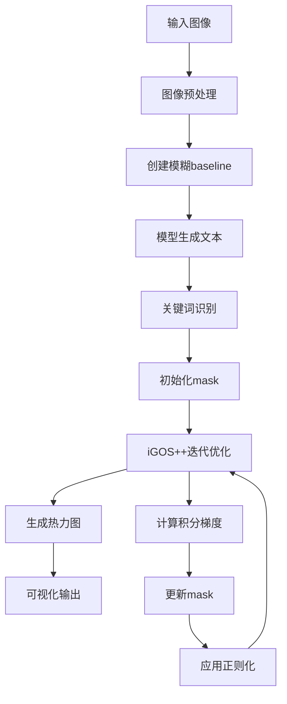

# QwenVL 可视化工作流算法详解

## 📋 目录
- [概述](#概述)
- [核心算法：iGOS++](#核心算法igos)
- [完整工作流程](#完整工作流程)
- [关键步骤详解](#关键步骤详解)
- [可视化结果生成](#可视化结果生成)
- [参数说明](#参数说明)

---

## 概述

本项目实现了一个基于 **iGOS++ (Integrated Gradients Optimized Saliency)** 的视觉解释方法，用于解释大型视觉语言模型（如 QwenVL）的决策过程。该算法通过生成显著性热力图来展示图像中哪些区域对模型的特定输出最为重要。

### 主要特点
- ✅ 基于积分梯度的优化方法
- ✅ 同时优化删除和插入mask
- ✅ 支持多种正则化约束
- ✅ 适用于大型视觉语言模型

---

## 核心算法：iGOS++

### 算法思想

iGOS++ 是一种**扰动-based**的可解释性方法，其核心思想是：

1. **删除目标**：找到图像中最重要的区域，删除这些区域应该最大程度降低模型对目标词的预测概率
2. **插入目标**：从模糊图像开始，插入这些重要区域应该最大程度提升模型对目标词的预测概率
3. **组合优化**：同时优化删除和插入两个mask，使其互补且一致

### 数学表达

算法优化以下目标函数：

```
minimize: L_del(mask_del) + L_ins(mask_ins) + L_reg(mask_del * mask_ins)
```

其中：
- **L_del**：删除损失，衡量删除重要区域后模型预测的下降程度
- **L_ins**：插入损失，衡量插入重要区域后模型预测的提升程度
- **L_reg**：正则化项，包括 L1、L2 和 TV norm

---

## 完整工作流程



### 流程图解

```
┌─────────────────────────────────────────────────────────────┐
│                     1. 图像预处理阶段                         │
├─────────────────────────────────────────────────────────────┤
│  原始图像                                                    │
│     ↓                                                       │
│  调整尺寸 (保持宽高比, 最大512px, 28的倍数)                   │
│     ↓                                                       │
│  创建模糊版本 (高斯模糊作为baseline)                          │
└─────────────────────────────────────────────────────────────┘

┌─────────────────────────────────────────────────────────────┐
│                     2. 模型推理阶段                           │
├─────────────────────────────────────────────────────────────┤
│  原图 + 文本提示 → 模型 → 生成文本描述                        │
│     ↓                                                       │
│  提取生成的token IDs和位置                                   │
└─────────────────────────────────────────────────────────────┘

┌─────────────────────────────────────────────────────────────┐
│                     3. 关键词识别阶段                         │
├─────────────────────────────────────────────────────────────┤
│  计算原图的预测概率 P(关键词|原图)                            │
│  计算模糊图的预测概率 P(关键词|模糊图)                        │
│     ↓                                                       │
│  选择满足条件的token:                                        │
│  log P(关键词|原图) - log P(关键词|模糊图) > 1.0              │
└─────────────────────────────────────────────────────────────┘

┌─────────────────────────────────────────────────────────────┐
│                     4. iGOS++优化阶段                         │
├─────────────────────────────────────────────────────────────┤
│  初始化: mask_del = 1, mask_ins = 1                         │
│     ↓                                                       │
│  迭代优化 (默认10次):                                        │
│    ├─ 上采样mask到图像尺寸                                   │
│    ├─ 计算组合mask的积分梯度                                 │
│    ├─ 计算删除mask的积分梯度                                 │
│    ├─ 计算插入mask的积分梯度                                 │
│    ├─ 计算正则化损失 (L1, L2, TV)                            │
│    ├─ 累加梯度并更新mask                                     │
│    └─ 限制mask值在[0,1]范围内                                │
└─────────────────────────────────────────────────────────────┘

┌─────────────────────────────────────────────────────────────┐
│                     5. 可视化生成阶段                         │
├─────────────────────────────────────────────────────────────┤
│  最终mask = mask_del * mask_ins                             │
│     ↓                                                       │
│  归一化到[0,1]                                               │
│     ↓                                                       │
│  生成JET colormap热力图                                      │
│     ↓                                                       │
│  叠加到原图 (alpha=0.4)                                      │
└─────────────────────────────────────────────────────────────┘
```

---

## 关键步骤详解

### 1. 图像预处理

**代码位置**: `gen_explanations_qwenvl()` 函数

```python
# 调整图像尺寸，保持宽高比
max_size = 512
original_width, original_height = image.size
aspect_ratio = original_width / original_height

if original_width > original_height:
    new_width = min(max_size, original_width)
    new_height = int(new_width / aspect_ratio)
else:
    new_height = min(max_size, original_height)
    new_width = int(new_height * aspect_ratio)

# 确保尺寸是28的倍数（适配QwenVL模型）
new_width = round(new_width / 28) * 28
new_height = round(new_height / 28) * 28
```

**为什么要这样做？**
- 保持宽高比：避免图像变形
- 最大512像素：平衡计算效率和细节保留
- 28的倍数：QwenVL模型的patch size要求

### 2. 创建Baseline

```python
# 使用高斯模糊创建baseline
kernel_size = get_kernel_size(image.size)  # 根据图像大小自适应
blur = cv2.GaussianBlur(np.asarray(image), (kernel_size, kernel_size), sigmaX=kernel_size-1)
```

**为什么用模糊图像？**
- 积分梯度方法需要一个baseline（参考点）
- 模糊图像保留了图像的整体结构，但去除了细节
- 便于比较原图和模糊图的差异

### 3. 关键词识别

**代码位置**: `find_keywords()` 函数

```python
def find_keywords(model, inputs, generated_ids, output_ids, image, blur_image, 
                  target_token_position, selected_token_word_id, tokenizer):
    # 计算原图和模糊图的预测概率
    probs = pred_probs(model, inputs, generated_ids, image, 
                       target_token_position, selected_token_word_id)
    probs_blur = pred_probs(model, inputs, generated_ids, blur_image, 
                            target_token_position, selected_token_word_id)
    
    # 选择对图像敏感的关键词
    condition = (torch.log(probs) - torch.log(probs_blur) > 1.0) & \
                (probs >= 0.0) & \
                (~torch.isin(output_ids[0], torch.tensor(special_ids).to(probs.device)))
    
    positions = torch.where(condition)[0].tolist()
    keywords = [tokenizer.decode(output_ids[0][idx]).strip() for idx in positions]
    
    return positions, keywords
```

**识别逻辑**：
1. 比较原图和模糊图的预测概率
2. 选择log概率差异大于1.0的token
3. 过滤掉特殊token（标点符号等）

### 4. `integrated_gradient()`：给当前 mask 算“该往哪改”的梯度

**代码位置**: `Advanced_IGOS_PP/IGOS_pp.py` 中的 `integrated_gradient()` 和 `interval_score()`。

这个函数名字叫积分梯度，但在当前代码里可以把它理解成一句话：**给定一张原图、一张 baseline 图和一个 mask，沿着“baseline → 被 mask 保留后的图像”这条路径取很多个点，看看目标 token 的 log 概率怎么变，然后反向传播，把梯度写回 mask。**

#### 输入参数怎么理解

- `image`：路径的一端，通常是原图 tensor。
- `baseline`：路径的另一端，通常是模糊图、全 0 图或其他参考图。
- `up_masks`：已经上采样到图像尺寸的 mask，值在 `[0, 1]`。越接近 1，越保留 `image`；越接近 0，越接近 `baseline`。
- `num_iter` / `ig_iter`：积分路径上采样多少个点。例如 `50` 就是取 `1/50, 2/50, ..., 1` 这 50 个 alpha。
- `ig_chunks`：把 `ig_iter` 分块 backward，主要是为了省显存。比如 `ig_iter=50, ig_chunks=5`，每次只算 10 个采样点，但总梯度仍然累加到同一个 mask 上。
- `positions`：要解释的目标 token 位置，只对这些 token 的 log 概率求和。
- `processor`：可选的图像打包函数。QwenVL 分支里会传 `tensor2pack`，把 `[B,C,H,W]` 转成模型需要的视觉 patch 格式。

#### 关键代码流程

```python
intervals = torch.linspace(1/num_iter, 1, num_iter).view(-1, 1, 1, 1)
interval_masks = up_masks.unsqueeze(1) * intervals
local_images = phi(images.unsqueeze(1), baseline.unsqueeze(1), interval_masks)
```

这几行在做路径采样。`intervals` 是一组 alpha，`interval_masks = mask * alpha`。当 alpha 很小时，图像更接近 baseline；当 alpha 接近 1 时，图像更接近当前 mask 作用后的图。

`phi()` 是真正混合图像的函数：

```python
def phi(img, baseline, mask):
    return img.mul(mask) + baseline.mul(1-mask)
```

所以每个采样点的图像都是：

```text
local_image = image * interval_mask + baseline * (1 - interval_mask)
```

然后 `interval_score()` 会逐个采样点喂给模型：

```python
log_probs = pred_probs(
    model,
    inputs,
    generated_ids,
    single_input,
    target_token_position,
    selected_token_word_id,
    need_grad=True,
    return_log_probs=True,
)
losses += log_probs[positions].sum()
```

这里不是直接看整句输出，而是只看 `positions` 指定的目标 token。比如你想解释 caption 里的 `"dog"`，那这里累加的就是 `"dog"` 对应位置的 log 概率。

最后：

```python
loss.sum().backward()
return loss.sum().item()
```

这一步很重要：`integrated_gradient()` 返回的是一个 Python 数值，方便打印 loss；但它真正有用的副作用是 `backward()`。调用结束后，梯度会写到依赖 `up_masks` 的原始 mask 上，也就是后面的 `masks_del.grad` 或 `masks_ins.grad`。

#### 为什么它叫“积分”

普通梯度只问：“当前 mask 这个点，往哪里动能让目标 token 概率变化最大？”  
积分梯度多问一步：“从 baseline 慢慢走到当前图像的整条路上，平均来看，哪些区域一直在影响目标 token？”

所以它比单点梯度更稳定一些。代码里用的是离散近似，也就是用 `ig_iter` 个采样点的平均值近似连续积分：

```python
final_loss = losses / num_iter
```

#### debug 时重点看什么

- 如果 `up_masks` 出 NaN，问题通常来自上一轮 mask 更新、学习率过大或正则项梯度异常。
- 如果 `local_images` 出 NaN，优先检查 `image`、`baseline`、`up_masks` 是否已经有 NaN，以及 `phi()` 混合前后的 dtype/range。
- 如果 `log_probs` 出 NaN，优先检查模型前向、`processor(single_img)` 输出、`positions` 是否越界，以及 fp16 下概率是否数值不稳定。
- 如果 `ig_chunks > 1`，必须满足 `ig_iter % ig_chunks == 0`，否则代码会直接抛 `ValueError`。
- 如果发现返回的 `loss_value` 正常但 mask 没变化，重点检查 `masks_del.grad` / `masks_ins.grad` 是否为 `None` 或全 0，因为真正驱动更新的是 `.grad`，不是返回值。

### 5. `iGOS_pp()`：反复优化两个 mask，找出“删掉会掉分、插入会涨分”的区域

**代码位置**: `Advanced_IGOS_PP/IGOS_pp.py` 中的 `iGOS_pp()`。

`iGOS_pp()` 是整个可视化算法的主循环。它不是直接算一张热力图，而是先维护两个低分辨率 mask：

- `masks_del`：删除 mask。希望找到“保留它时目标 token 分数高、拿掉它时分数明显下降”的区域。
- `masks_ins`：插入 mask。希望找到“从 baseline 开始只插入它时，目标 token 分数明显上升”的区域。

最后返回的是：

```python
return masks_del * masks_ins, losses_del, losses_ins, ...
```

也就是说最终可视化用的是两个 mask 的乘积。只有同时被删除目标和插入目标认可的区域，才会在最终 mask 里留下来。

#### 初始化阶段

```python
masks_del = torch.ones((1, 1, size, size), dtype=torch.float32, device=device)
masks_del = masks_del * init_mask.to(device)
masks_del = Variable(masks_del, requires_grad=True)

masks_ins = torch.ones((image.shape[0], 1, size, size), dtype=torch.float32, device=device)
masks_ins = masks_ins * init_mask.to(device)
masks_ins = Variable(masks_ins, requires_grad=True)
```

这里的 mask 是低分辨率的，比如当前 QwenVL 配置里 `size=48`，不是原图尺寸。每轮迭代时会用 `upscale()` 放大到图像尺寸，这样优化更省显存，也让结果更平滑。

`init_mask` 来自 `get_initial()`。当前配置里 `init_val=0.5`，可以理解成一开始每个区域“半保留、半遮挡”，然后再靠梯度把重要区域和背景拉开。

#### 每轮迭代做什么

每一轮大致是：

1. 把两个低分辨率 mask 上采样到图像尺寸。
2. 对组合 mask、删除 mask、插入 mask 分别调用 `integrated_gradient()`。
3. 从 `.grad` 里取出梯度并按删除/插入方向组合。
4. 加上 L1、TV、L2 正则化梯度。
5. 用 `LS` 或 `NAG` 更新 mask。
6. 把 mask clamp 回 `[0, 1]`。

代码对应关系如下：

```python
up_masks1 = upscale(masks_del, image)
up_masks2 = upscale(masks_ins, image)
combined_mask = up_masks1 * up_masks2
```

`up_masks1` 是删除 mask 的图像尺寸版本，`up_masks2` 是插入 mask 的图像尺寸版本，`combined_mask` 是二者交集。

#### 四次 `integrated_gradient()` 分别在干什么

一轮里最核心的是这四次调用：

```python
loss_comb_del = integrated_gradient(..., image, ..., baseline, up_masks1 * up_masks2, ...)
loss_comb_ins = integrated_gradient(..., image, ..., baseline, up_masks1 * up_masks2, ...)
loss_del = integrated_gradient(..., image, ..., baseline, up_masks1, ...)
loss_ins = integrated_gradient(..., image, ..., baseline, up_masks2, ...)
```

从意图上看，它们分别对应：

- `loss_comb_del`：看两个 mask 共同保留的区域，在删除目标下有多重要。
- `loss_comb_ins`：看两个 mask 共同保留的区域，在插入目标下有多重要。
- `loss_del`：单独更新删除 mask，让它更擅长找到“删掉会影响目标 token”的区域。
- `loss_ins`：单独更新插入 mask，让它更擅长找到“插入就能恢复目标 token”的区域。

当前代码里插入方向通过“减梯度”实现：

```python
total_grads1 -= masks_del.grad.clone()
total_grads2 -= masks_ins.grad.clone()
...
total_grads2 -= masks_ins.grad.clone()
```

原因是删除和插入的优化方向相反：删除希望找到让原图分数下降的区域，插入希望找到能从 baseline 中把分数拉起来的区域。所以同样是目标 token 的 log 概率，插入项在组合梯度时要反向处理。

注意一个很适合 debug 的细节：经典 insertion 通常会把 `image` 和 `baseline` 的角色互换，也就是从 baseline 逐渐插入原图；但当前 `Advanced_IGOS_PP/IGOS_pp.py` 主循环里的 `loss_comb_ins` 和 `loss_ins` 调用，实参顺序仍然是 `image, ..., baseline`，主要靠后面的“减梯度”体现反向优化。如果你后面发现 insertion loss 行为和预期不一致，可以优先对比根目录 `methods.py` 里的旧版写法，那里插入项是 `integrated_gradient(..., baseline, image, ...)`。

#### 正则化在约束什么

```python
loss_l1, loss_tv, loss_l2 = regularization_loss(image, masks_del * masks_ins)
losses = loss_l1 + loss_tv + loss_l2
losses.sum().backward()
total_grads1 += masks_del.grad.clone()
total_grads2 += masks_ins.grad.clone()
```

正则化不是模型分数，它是在约束 mask 的形状：

- `L1 * mean(abs(1 - masks))`：控制 mask 不要随便大面积偏离 1。
- `L3 * bilateral_tv_norm(...)`：让 mask 空间上更连续，同时尽量尊重图像边缘，避免热力图变成散点噪声。
- `L2 * sum((1 - masks)^2)`：进一步惩罚过强遮挡，防止 mask 全部塌到 0。

debug 时如果热力图特别碎，通常先看 `L3` / TV；如果 mask 几乎全白或全黑，通常看 `L1`、`L2`、`lr` 和目标 token 的 loss 是否有有效梯度。

#### mask 是怎么更新的

当前常用配置是 `opt='NAG'`：

```python
e = i / (i + momentum)
cita_d = masks_del.data - lr * total_grads1
cita_i = masks_ins.data - lr * total_grads2
masks_del.data = cita_d + e * (cita_d - cita_d_p)
masks_ins.data = cita_i + e * (cita_i - cita_i_p)
```

可以把它理解成“带惯性的梯度下降”：本轮先按梯度走一步，再叠加一点上一轮到这一轮的运动方向。好处是收敛可能更快；坏处是如果 `lr` 太大或梯度有 NaN，问题会被动量放大。

最后一定会执行：

```python
masks_del.data.clamp_(0, 1)
masks_ins.data.clamp_(0, 1)
```

这是为了保证 mask 仍然是可解释的比例值。debug 时如果你看到更新前数值已经飞到很大，但更新后又都被 clamp 到 0 或 1，说明学习率或梯度尺度很可能过强。

#### 一轮输出的 loss 怎么看

每轮会打印：

```text
iteration: i lr: ... loss_comb_del: ..., loss_comb_ins: ...,
loss_del: ..., loss_ins: ..., loss_l1: ..., loss_tv: ..., loss_l2: ...
```

建议 debug 时这样读：

- `loss_del` / `loss_ins` 长时间不变：目标 token 可能没选好、mask 梯度断了，或 `processor` 后图像没有真正变化。
- `loss_l1`、`loss_l2` 很大：mask 正在大面积远离 1，可能遮挡过强。
- `loss_tv` 很大：mask 很碎，空间不平滑。
- 某个 loss 变成 NaN：按日志里的 `[NaN DEBUG]` 往前追，通常先定位是 `up_masks`、`local_images`、`log_probs` 还是正则项。
- mask 每轮都接近全 0 或全 1：优先检查 `lr`、`total_grads` 范围、`clip_grad_norm_` 是否真的限制住了数值，以及 `L1/L2/L3` 是否把优化目标压住了。

#### 和最终热力图的关系

`iGOS_pp()` 返回的 mask 不是“值越大越红”那么简单。后处理里会先归一化，然后做：

```python
heatmap = np.uint8(255 * np.clip(1.0 - masks, 0.0, 1.0))
```

也就是说当前可视化会把 `1 - masks` 送进 JET colormap。README 后面说的“红色重要区域”，对应的是最终处理后的暖色区域；如果你直接看原始 `masks` 数值，要注意它和显示颜色之间有一次反转。

**优化策略总结**：
1. **双 mask 优化**：用 `masks_del` 和 `masks_ins` 同时约束显著区域，减少单一删除或插入目标带来的偏差。
2. **组合 mask 约束**：用 `masks_del * masks_ins` 让两个 mask 的交集也满足删除/插入目标。
3. **积分梯度取梯度**：每次不是只看一个扰动点，而是沿 baseline 到当前图像的路径平均估计影响。
4. **正则化控形状**：L1/L2 控制遮挡面积和强度，TV 控制空间连续性。
5. **NAG/LS 更新**：`NAG` 用动量加速，`LS` 用线搜索自适应步长；当前 QwenVL 配置主要走 `NAG`。

### 6. 正则化

```python
def regularization_loss(image, masks):
    # L1正则化：鼓励稀疏性
    loss_l1 = L1 * torch.mean(torch.abs(1 - masks).view(masks.shape[0], -1), dim=1)
    
    # 双边TV正则化：保持边缘平滑
    loss_tv = L3 * bilateral_tv_norm(image, masks, tv_beta=2, sigma=0.01)
    
    # L2正则化：鼓励mask接近1
    loss_l2 = L2 * torch.sum((1 - masks)**2, dim=[1, 2, 3])
    
    return loss_l1, loss_tv, loss_l2
```

**正则化作用**：
- **L1**：产生稀疏的mask，突出关键区域
- **TV norm**：保持空间连续性，避免碎片化
- **L2**：防止mask过度偏离1

---

## 可视化结果生成

### 最终处理流程

```python
# 获取最终mask
masks = masks_del * masks_ins
masks = masks[0, 0].detach().cpu().numpy()

# 归一化到[0,1]
masks -= np.min(masks)
masks /= np.max(masks)

# 调整到原始图像尺寸
masks = cv2.resize(masks, (image.shape[1], image.shape[0]))

# 生成热力图
heatmap = np.uint8(255 * (1 - masks))  # 反转，重要区域显示为红色
heatmap = cv2.applyColorMap(heatmap, cv2.COLORMAP_JET)

# 叠加到原图
superimposed_img = heatmap * 0.4 + original_image
superimposed_img = np.clip(superimposed_img, 0, 255).astype(np.uint8)
```

### 颜色含义

- 🔴 **红色区域**：对模型预测最重要的区域
- 🔵 **蓝色区域**：对模型预测不重要的区域
- 🟡 **黄色/绿色**：中等重要性的区域

---

## 参数说明

### 主要参数

| 参数 | 默认值 | 说明 |
|------|--------|------|
| `size` | 32 | mask的初始尺寸（会通过上采样匹配图像） |
| `iterations` | 10 | iGOS++优化迭代次数 |
| `ig_iter` | 10 | 积分梯度采样次数 |
| `lr` | 1e-4 | 学习率 |
| `L1` | 1.0 | L1正则化系数 |
| `L2` | 0.1 | L2正则化系数 |
| `L3` | 10.0 | TV正则化系数 |
| `max_size` | 512 | 图像最大边长 |

### 参数调优建议

1. **迭代次数**：
   - 增加迭代次数 → 更精确的mask，但计算时间更长
   - 建议：5-15次

2. **学习率**：
   - 过大 → 梯度爆炸，mask不稳定
   - 过小 → 收敛太慢
   - 建议：1e-5 到 1e-3

3. **正则化系数**：
   - L1 ↑ → 更稀疏的mask
   - L2 ↑ → mask更接近全1
   - L3 ↑ → 更平滑的mask

---

## 代码结构

```
LVLM_Interpretation/
├── Advanced_IGOS_PP/
│   ├── IGOS_pp.py              # iGOS++核心算法实现
│   ├── methods_helper.py       # 辅助函数（正则化、上采样等）
│   └── utils.py                # 工具函数
├── Qwen25-VL-3B-coco-caption-igos.py  # QwenVL主程序
└── README_可视化算法说明.md    # 本文档
```

---

## 核心函数说明

### 1. `gen_explanations_qwenvl()`
**功能**：QwenVL模型的可视化主函数

**输入**：
- `model`: QwenVL模型
- `processor`: 数据处理器
- `image`: PIL图像
- `text_prompt`: 文本提示
- `tokenizer`: 分词器

**输出**：
- `masks`: 显著性mask
- `superimposed_img`: 叠加热力图的图像

### 2. `iGOS_pp()`
**功能**：iGOS++优化算法

**核心步骤**：
1. 初始化删除和插入mask
2. 迭代优化：
   - 计算积分梯度
   - 更新mask
   - 应用正则化
3. 返回组合mask

### 3. `integrated_gradient()`
**功能**：计算积分梯度

**原理**：
- 在baseline到原图的路径上积分
- 使用黎曼和近似
- 返回梯度用于优化

### 4. `find_keywords()`
**功能**：识别对图像敏感的关键词

**方法**：
- 比较原图和模糊图的预测概率
- 选择log概率差异大的token

---

## 使用示例

```python
from PIL import Image
from transformers import Qwen2_5_VLForConditionalGeneration, AutoProcessor
from Advanced_IGOS_PP.IGOS_pp import gen_explanations_qwenvl

# 加载模型
model = Qwen2_5_VLForConditionalGeneration.from_pretrained(
    "Qwen/Qwen2.5-VL-3B-Instruct",
    torch_dtype=torch.float16,
    device_map="auto"
)
processor = AutoProcessor.from_pretrained("Qwen/Qwen2.5-VL-3B-Instruct")

# 加载图像
image = Image.open("example.jpg").convert('RGB')
text_prompt = "Describe the image in one sentence."

# 生成可视化
masks, heatmap = gen_explanations_qwenvl(
    model=model,
    processor=processor,
    image=image,
    text_prompt=text_prompt,
    tokenizer=processor.tokenizer
)

# 保存结果
cv2.imwrite("heatmap.jpg", heatmap)
```

---

## 算法优势

1. **理论基础扎实**：基于积分梯度，有明确的数学推导
2. **双向优化**：同时考虑删除和插入，结果更可靠
3. **正则化完善**：多种正则化约束，避免过拟合
4. **适用性广**：可应用于各种视觉语言模型

## 局限性

1. **计算开销大**：需要多次前向传播计算积分梯度
2. **参数敏感**：需要调整多个超参数
3. **baseline依赖**：结果可能受baseline选择影响

---

## 参考文献

- **Integrated Gradients**: Sundararajan et al., "Axiomatic Attribution for Deep Networks", ICML 2017
- **iGOS**: Khorram et al., "iGOS++: Integrated Gradient Optimized Saliency", 2020
- **QwenVL**: Bai et al., "Qwen-VL: A Frontier Large Vision-Language Model", 2023

---

## 总结

QwenVL可视化工作流通过iGOS++算法实现了对视觉语言模型决策过程的可解释性分析。该算法通过优化删除和插入mask，结合积分梯度和多种正则化技术，能够准确地定位图像中对模型预测最重要的区域。生成的热力图直观地展示了模型的关注点，为理解模型行为提供了有力工具。
